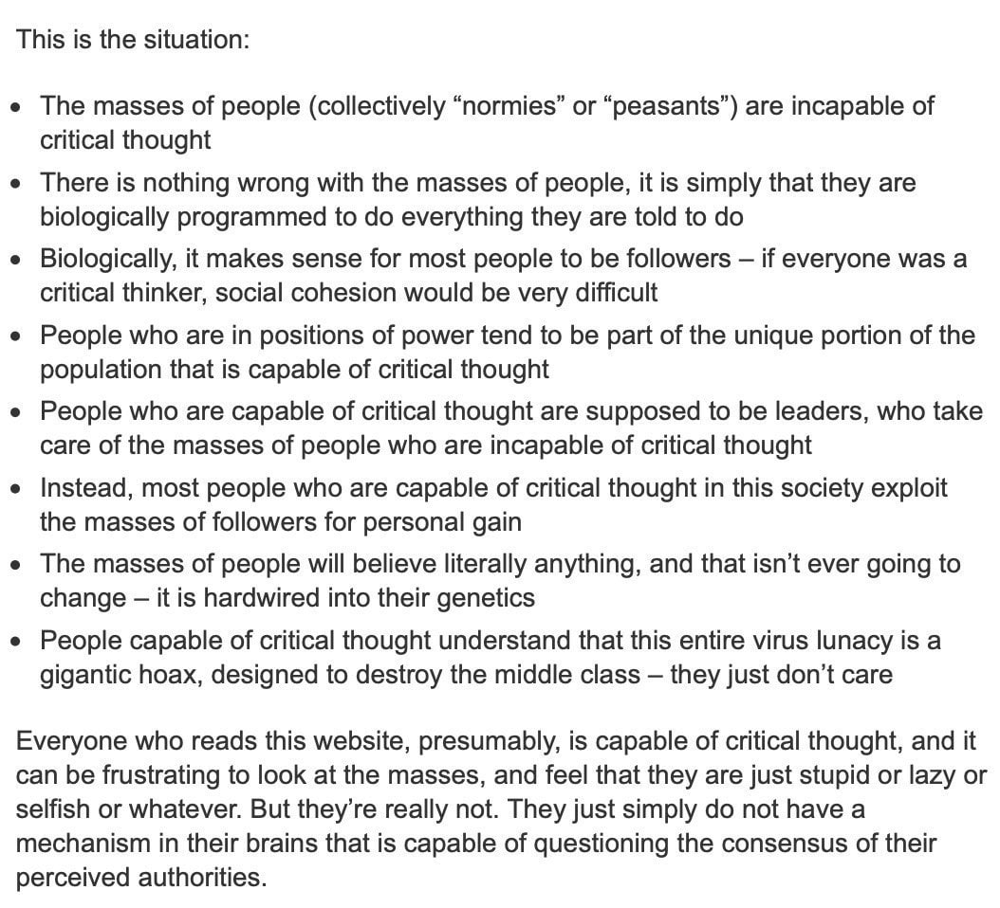

Thank you all for building software together, that lead to develop society with true, technology/medicine based equity, or just are fun things to do. I've migrated my best achievements from software engineering during several years, to GitLab: https://gitlab.com/john-byte, as this seems safer space for now. I had already started migration process with aims to complicate Microsoft's code analysis for their "evil thing", but I only claimed to start new projects in GitLab and migrate some recents to it. And current situation triggered a more massive migration to GitLab. 

